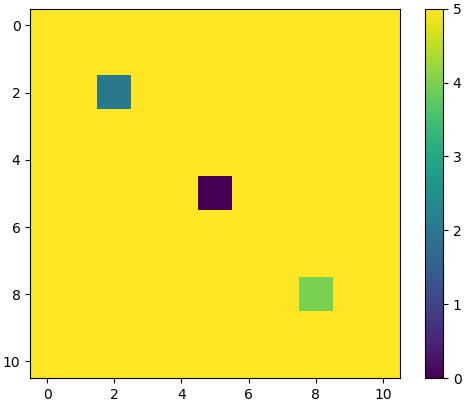
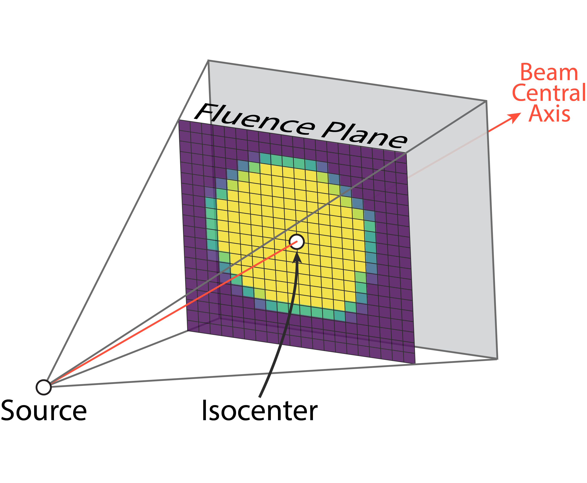
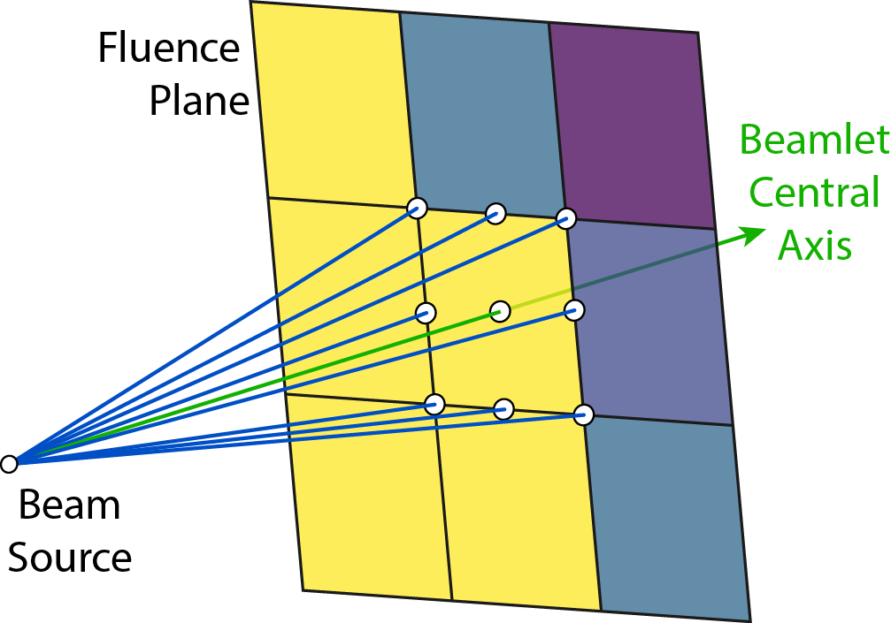
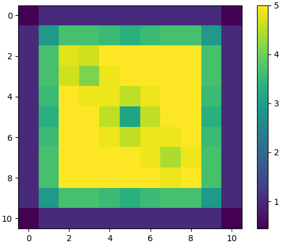

# Raytrace
General purpose python ray tracing library implemented in on GPU in CUDA as a Cython extension

This code is based on Siddon's algorithm, which has been quite extensively used in medical physics for CT projection and radiation treatment planning.

## Usage
This library allows one to calculate the _radiologic path-length (rpl)_ along a defined ray through a 3D voxel volume. This functionality can be used to obtain the forward radon transform of a volume for any given source-detector geometry, or even detect collisions with solid objects (represented as binary volumes) -- for example.

### The `raytrace()` General Purpose Function:
Below is an example of how to perform raytracing to get the rpl for a set of rays, each defined by a pair of source and destination coordinates, relative to the volume start coordinates and voxelsize:
```python
import numpy as np
import matplotlib.pyplot as plt

from raytrace import raytrace

# setup volume with "hole"
vol = np.ones((5,11,11))
vol[:, 5, 5] = 0

# create 3D source-destination pairs
sources = np.stack([
    *np.meshgrid(
        np.arange(0.5, 11.5, 1),
        np.arange(0.5, 11.5, 1),
    ),
    -10.0*np.ones((11,11)),
]).reshape((3,-1)).T
dests = sources.copy()
dests[:, 2] = 10.0

# run raytrace
rpl = raytrace(dests, sources, vol, vol_start=(0,0,0), vol_spacing=(1,1,1))
rpl = rpl.reshape((11,11))

# show raytracing output
import matplotlib.pyplot as plt
plt.imshow(rpl)
plt.show()
```


### The `beamtrace()` Convenience Function
While the `raytrace()` function offers a general interface for tracing through a volume between individual (source, destination) coordinate pairs, often in radiation therapy, we are constrained to the geometry in which a single coordinate acts as a "common source" for a set of destination coordinates constrained to a plane, which is typically called the _fluence plane_; the `beamtrace()` function was developed for this purpose.

In this geometry, instead of directly specifying destination coordinates, we instead describe a plane's (the _fluence plane_) position, shape, grid-structure, and orientation within the volume and designate the coordinates in each of the grid's cells as the destination points (see figure below-left). In addition to this difference, a 9-point supersampling arrangement (see figure below-right) is also traced for each of the grid cells to ensure that any contact of each sub-beam with the mask in the volume will be counted (in the `raytrace()` function, it is only the intersections of the volume with the 1D ray between source-destination pairs, where-as here the intersection of the volume and the volume of the diverging square sub-beam are counted).

<table style='text-align:center'>
  <tr>
    <td>
      
    </td>
    <td>
      
    </td>
  </tr>
  <tr>
    <td>Constrained geometry of the <code>beamtrace()</code> function</td>
    <td style='word-wrap:break-word'>9-point supersampling arrangement of the <code>beamtrace()</code> function</td>
  </tr>
</table>

Here is an example of how to perform beamtracing to get the rpl for a set of these volumetric sub-beams (beamlets):
```python
import numpy as np
import matplotlib.pyplot as plt

from raytrace import beamtrace

# setup volume with "hole"
#   convention for beamtrace is along +y axis when angles=(0,0,0)
vol = np.ones((11,5,11))
vol[2, 2:, 2] = 0
vol[5, :, 5] = 0
vol[8, 4:, 8] = 0

# define constrained "fluence plane" geometry
sad = 10.0
plane_size = (11, 11)
plane_center = (5.5, 0, 5.5)
plane_spacing = (1,1)
angles = (0, 0, 0) # adjustable "beam angles"

# run raytrace
rpl = beamtrace(sad, plane_size, plane_center, plane_spacing, *angles, vol, vol_start=(0,0,0), vol_spacing=(1,1,1))
rpl = rpl.reshape((11,11))

# show raytracing output
import matplotlib.pyplot as plt
plt.imshow(rpl)
plt.colorbar()
plt.show()
```


## Installation
The simplest way to install this libary is to run 
```sh
pip install git+https://github.com/ryanneph/raytrace.git@master#egg=raytrace
```

Alternatively if you wish to install from source you can first clone/cd this repo, then run
```sh
pip install .
```

## Developing
To get started with developing this library, first clone/cd this repo then run
```sh
make build
```
or, on systems without make:
```sh
python setup.py build_ext --inplace
```
